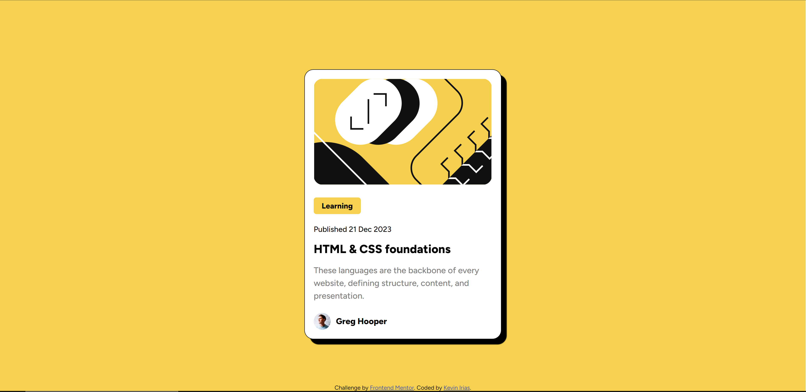

# Frontend Mentor - QR code component solution

This is a solution to the [Blog preview card challenge on Frontend Mentor](https://www.frontendmentor.io/challenges/blog-preview-card-ckPaj01IcS). Frontend Mentor challenges help you improve your coding skills by building realistic projects. 

## Table of contents

- [Overview](#overview)
  - [Screenshot](#screenshot)
  - [Links](#links)
- [My process](#my-process)
  - [Built with](#built-with)
  - [What I learned](#what-i-learned)
- [Author](#author)

## Overview

### Screenshot

### Links

- Solution URL: [(https://github.com/kiriasru/blog-review-card)]
- Live Site URL: [https://kiriasru.github.io/blog-review-card/]

## My process

### Built with

- Semantic HTML5 markup
- CSS custom properties
- Flexbox

### What I learned

Making a card component by using HTML and CSS

## Author

- Website - [Kevin Irias](https://github.com/kiriasru)
- Frontend Mentor - [@kiriasru](https://www.frontendmentor.io/profile/kiriasru)
